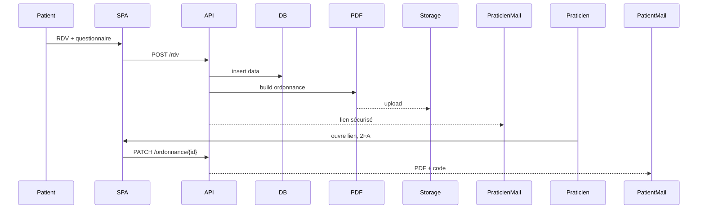

# Medicapp – Architecture MVP

## 1. Contexte (C4 – niveau 1)

Patient, Praticien, Hébergeur HDS (OVHcloud Santé).

## 2. Conteneurs (C4 – niveau 2)

| Conteneur | Tech                    | Rôle                             |
| --------- | ----------------------- | -------------------------------- |
| SPA       | React + Vite + Tailwind | UI patient / praticien           |
| API       | FastAPI                 | Endpoints, auth JWT, logique PDF |
| DB        | PostgreSQL HDS          | patients, RDV, réponses, logs    |
| Storage   | Object Storage HDS      | PDFs horodatés, accès signés     |
| Mailer    | Postfix → Mailjet       | Envoi liens sécurisés            |
| Auth 2FA  | PyOTP (TOTP) + SMS      | MFA praticien                    |

## 3. Flux principal

## 4. Risques majeurs

| Risque                    | Impact         | Mitigation (Sprint 4)          |
| ------------------------- | -------------- | ------------------------------ |
| Lien PDF intercepté       | Fuite données  | URL signée TTL 15 min          |
| Panne DB                  | Service down   | Backups h + test restore hebdo |
| Injection SQL             | Corruption     | ORM + tests e2e                |
| Actions admin non tracées | Non-conformité | Middleware audit immuable      |
