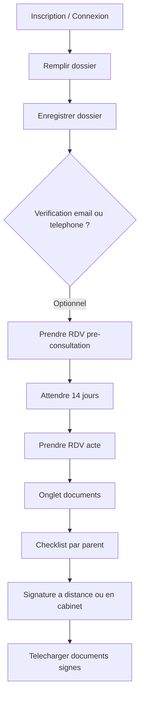
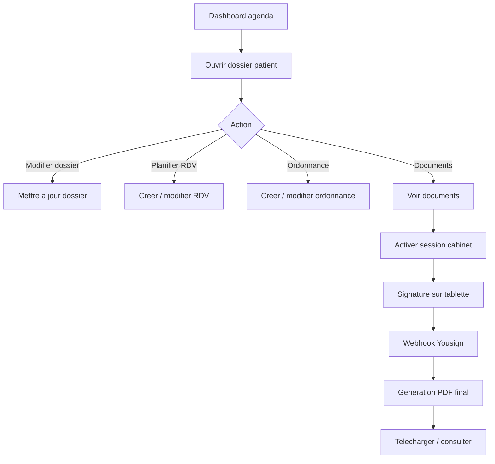

# Logigrammes MedicApp

## Parcours patient

```mermaid
flowchart TD
    A[Inscription / Connexion] --> B[Remplir dossier]
    B --> C[Enregistrer dossier]
    C --> D{Verification email ou telephone ?}
    D -->|Optionnel| E[Prendre RDV pre-consultation]
    E --> F[Attendre 14 jours]
    F --> G[Prendre RDV acte]
    G --> H[Onglet documents]
    H --> I[Checklist par parent]
    I --> J[Signature a distance ou en cabinet]
    J --> K[Telecharger documents signes]
```

## Parcours praticien

```mermaid
flowchart TD
    A[Dashboard agenda] --> B[Ouvrir dossier patient]
    B --> C{Action}
    C -->|Modifier dossier| D[Mettre a jour dossier]
    C -->|Planifier RDV| E[Creer / modifier RDV]
    C -->|Ordonnance| F[Creer / modifier ordonnance]
    C -->|Documents| G[Voir documents]
    G --> H[Activer session cabinet]
    H --> I[Signature sur tablette]
    I --> J[Webhook Yousign]
    J --> K[Generation PDF final]
    K --> L[Telecharger / consulter]
```
